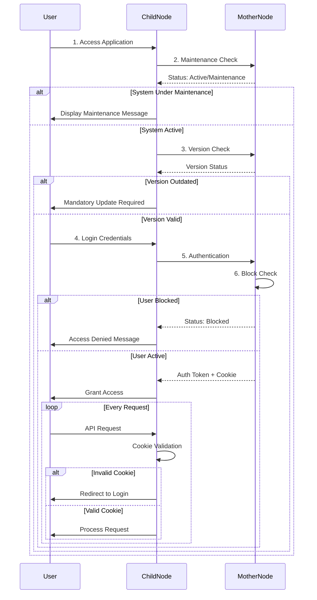
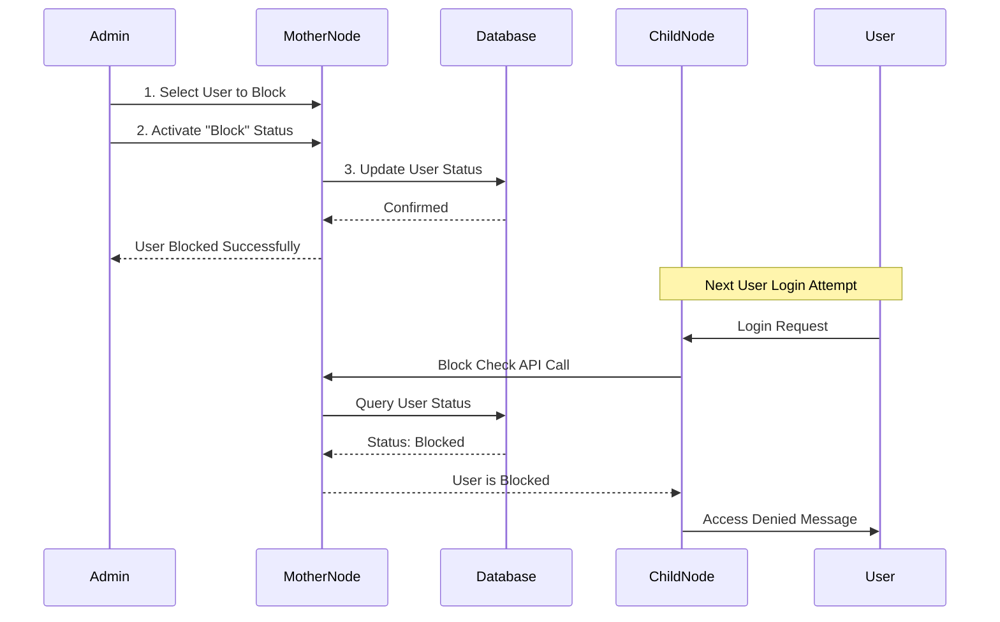

# 🏗️ xMati: Mother-Child Node Architecture

<div align="center">

**A Distributed Architecture for Data Sovereignty & Centralized Control**

---

[]()
[]()
[]()

</div>

---

## 📋 Table of Contents

- [Executive Summary](#-executive-summary)
- [System Architecture](#-system-architecture)
- [Operational Flow](#-operational-flow)
- [Security & Control Mechanisms](#-security--control-mechanisms)
- [Admin Control Panel](#-admin-control-panel)
- [Technical Considerations](#-technical-considerations)

---

## 🎯 Executive Summary

The xMati project implements a **distributed Mother-Child Node architecture** that elegantly balances two critical requirements:

<table>
<tr>
<td width="50%" valign="top">

### 🔒 Data Sovereignty
- ✅ Client data stays **within their infrastructure**
- ✅ Full control over data storage & access
- ✅ Compliance with data residency requirements
- ✅ Docker volume persistence

</td>
<td width="50%" valign="top">

### 🎛️ Centralized Control
- ✅ Unified user & subscription management
- ✅ System-wide updates from single point
- ✅ Real-time monitoring & enforcement
- ✅ License compliance automation

</td>
</tr>
</table>

---

## 🏗️ System Architecture

### High-Level Architecture Diagram

```
┌─────────────────────────────────────────────────────────────────────┐
│                         🌐 MOTHER NODE                              │
│                    (Centrally Hosted by xMati)                      │
├─────────────────────────────────────────────────────────────────────┤
│                                                                     │
│  📊 Admin Dashboard  │  👥 User Registry  │  💳 Subscriptions      │
│  🔧 System Control   │  📈 Analytics      │  🔐 Authentication     │
│                                                                     │
└──────────────┬──────────────────────────┬────────────────┬─────────┘
               │                          │                │
               │ HTTPS + API Keys         │                │
               ▼                          ▼                ▼
    ┌──────────────────┐      ┌──────────────────┐      ┌──────────────────┐
    │  🏢 Client A     │      │  🏢 Client B     │      │  🏢 Client C     │
    │  CHILD NODE      │      │  CHILD NODE      │      │  CHILD NODE      │
    ├──────────────────┤      ├──────────────────┤      ├──────────────────┤
    │ 🤖 Bot Engine    │      │ 🤖 Bot Engine    │      │ 🤖 Bot Engine    │
    │ 💬 QnA System    │      │ 💬 QnA System    │      │ 💬 QnA System    │
    │ 📊 Analytics     │      │ 📊 Analytics     │      │ 📊 Analytics     │
    │ 🗄️  Data Storage │      │ 🗄️  Data Storage │      │ 🗄️  Data Storage │
    └──────────────────┘      └──────────────────┘      └──────────────────┘
    Docker Container          Docker Container          Docker Container
```

---

## 🔵 Child Node (Client-Deployed)

<div style="background-color: #f0f8ff; padding: 20px; border-radius: 10px; border-left: 5px solid #4CAF50;">

### 📦 What is it?

The **Child Node** is the core application that runs **inside each client's infrastructure**. Think of it as the "worker" that handles all the actual bot operations while keeping data secure within the client's environment.

</div>

### 🏗️ Architecture Characteristics

```
┌─────────────────────────────────────────────────────┐
│          CHILD NODE (Monolithic Design)             │
│                                                     │
│  Single Node = Complete Application Instance       │
│  No Built-in Multi-tenancy                         │
└─────────────────────────────────────────────────────┘
```

### 📦 Deployment Model

```
┌─────────────────────────────────────────┐
│      Client Infrastructure              │
│  ┌───────────────────────────────────┐  │
│  │     🐳 Docker Container           │  │
│  │  ┌─────────────────────────────┐  │  │
│  │  │   xMati Child Node App      │  │  │
│  │  └─────────────────────────────┘  │  │
│  │  ┌─────────────────────────────┐  │  │
│  │  │  💾 Docker Persistent       │  │  │
│  │  │     Volume                  │  │  │
│  │  │  • Bot Data                 │  │  │
│  │  │  • User Sessions            │  │  │
│  │  │  • Analytics Data           │  │  │
│  │  └─────────────────────────────┘  │  │
│  └───────────────────────────────────┘  │
└─────────────────────────────────────────┘
```

### ⚙️ Key Features

| Feature | Description |
|---------|-------------|
| 🤖 **Bot Management** | Create, update, and delete bots |
| 💬 **QnA System** | Intelligent question-answer management |
| 📊 **Analytics** | Real-time reporting and insights |
| 👤 **User Profiles** | Profile & password management |
| 🔒 **Privacy** | Privacy policy access |
| 📧 **Enquiries** | Enquiry submission system |
| 🚪 **Session Management** | Secure logout functionality |

---

## 🔴 Mother Node (Central Management)

<div style="background-color: #fff0f0; padding: 20px; border-radius: 10px; border-left: 5px solid #FF5722;">

### 🎛️ What is it?

The **Mother Node** is the central command center hosted by xMati. It acts as the "brain" that manages all Child Nodes, handles subscriptions, and enforces system-wide policies.

</div>

### ☁️ Deployment Model

```
┌─────────────────────────────────────────┐
│      xMati Cloud Infrastructure         │
│  ┌───────────────────────────────────┐  │
│  │     Mother Node Platform          │  │
│  │                                   │  │
│  │  • User Registration              │  │
│  │  • Subscription Management        │  │
│  │  • Payment Processing             │  │
│  │  • Admin Dashboard                │  │
│  │  • System Monitoring              │  │
│  │  • License Enforcement            │  │
│  │                                   │  │
│  └───────────────────────────────────┘  │
└─────────────────────────────────────────┘
```

### ⚙️ Key Features

| Feature | Description |
|---------|-------------|
| 📝 **Registration** | Onboard new clients & provision Child Nodes |
| 💳 **Subscriptions** | Manage plans, payments & licensing limits |
| 👨‍💼 **Admin Dashboard** | Monitor & manage entire xMati ecosystem |
| 🔐 **Access Control** | Block/unblock users remotely |
| 📊 **System Analytics** | Cross-client insights & reporting |
| 🔄 **Version Control** | Enforce version compliance |

---

## 🔄 Operational Flow

### System Startup & Authentication Flow



---

## 🛡️ Security & Control Mechanisms

### 🔵 Child Node Security Checks

The Child Node performs continuous validation by communicating with the Mother Node API:

<table>
<thead>
<tr>
<th>Check #</th>
<th>Check Name</th>
<th>Purpose</th>
<th>Trigger Point</th>
<th>Failure Action</th>
</tr>
</thead>
<tbody>
<tr>
<td>1️⃣</td>
<td><b>🔧 Maintenance Check</b></td>
<td>Enforce planned downtime or system updates</td>
<td>Pre-login, periodic intervals</td>
<td>Display "System under Maintenance" message</td>
</tr>
<tr>
<td>2️⃣</td>
<td><b>📦 Version Check</b></td>
<td>Ensure supported & secure version</td>
<td>Application startup</td>
<td>Notify mandatory update required</td>
</tr>
<tr>
<td>3️⃣</td>
<td><b>🚫 Block Check</b></td>
<td>Remotely disable non-compliant users</td>
<td>Post-authentication</td>
<td>Display blocking message & deny access</td>
</tr>
<tr>
<td>4️⃣</td>
<td><b>🍪 Cookie Check</b></td>
<td>Validate session integrity & authentication</td>
<td>Every authenticated request</td>
<td>Invalidate session, redirect to login</td>
</tr>
</tbody>
</table>

### 🔴 Mother Node Security Enforcement

```
┌─────────────────────────────────────────────────────────┐
│            MOTHER NODE ENFORCEMENT LAYER                │
├─────────────────────────────────────────────────────────┤
│                                                         │
│  ✓ Maintenance Mode      → Controls all endpoints      │
│  ✓ Block Check           → Applied on registration     │
│  ✓ Version Compliance    → Applied on subscriptions    │
│  ✓ API Authentication    → HTTPS + API Keys            │
│  ✓ Session Management    → Cookie validation           │
│                                                         │
└─────────────────────────────────────────────────────────┘
```

### Heartbeat & Health Monitoring

```
Child Node                                  Mother Node
    │                                            │
    │────────── Heartbeat (Every 30s) ─────────>│
    │                                            │
    │<──────── Status + Config Update ──────────│
    │                                            │
    │  • Maintenance Status                     │
    │  • Version Requirements                   │
    │  • Block Status                           │
    │  • System Configuration                   │
    │                                            │
```

---

## 👨‍💼 Admin Control Panel

### User Blocking Workflow



### Admin Dashboard Features

<div style="display: grid; grid-template-columns: 1fr 1fr; gap: 20px;">

<div style="background-color: #e8f5e9; padding: 15px; border-radius: 8px;">

#### 👥 User Management
- View all registered users
- Block/Unblock users
- Monitor user activity
- Track subscription status

</div>

<div style="background-color: #e3f2fd; padding: 15px; border-radius: 8px;">

#### 📊 System Monitoring
- Real-time health checks
- Version compliance tracking
- Active sessions monitoring
- Performance metrics

</div>

<div style="background-color: #fff3e0; padding: 15px; border-radius: 8px;">

#### 🔧 System Control
- Enable/Disable maintenance mode
- Force version updates
- Manage system configuration
- Emergency shutdowns

</div>

<div style="background-color: #fce4ec; padding: 15px; border-radius: 8px;">

#### 💳 Subscription Management
- View all subscriptions
- Track payment status
- Manage plan changes
- Handle renewals

</div>

</div>

---

## ⚠️ Technical Considerations

### 🔒 Absolute Code Blocking (Critical Feature)

<div style="background-color: #fff9c4; padding: 20px; border-radius: 10px; border-left: 5px solid #FFC107;">

**Challenge:** Ensuring reliable blocking even when Child Nodes are deployed in isolated environments.

</div>

#### Mitigation Strategies

```
┌─────────────────────────────────────────────────────────────┐
│                 BLOCKING ENFORCEMENT STRATEGY               │
├─────────────────────────────────────────────────────────────┤
│                                                             │
│  1️⃣  ROBUST HEARTBEAT MECHANISM                            │
│     • Frequent polling (every 30 seconds)                   │
│     • Resilient retry logic with exponential backoff        │
│     • Multiple fallback endpoints                           │
│                                                             │
│  2️⃣  FAIL-SECURE DESIGN                                    │
│     • Default to BLOCKED state if Mother Node unreachable   │
│     • Grace period: 3 failed attempts = Auto-block          │
│     • Prevents unauthorized use during network issues       │
│                                                             │
│  3️⃣  CACHED STATUS WITH TTL                                │
│     • Cache last known status (TTL: 5 minutes)              │
│     • Require fresh validation after TTL expiry             │
│     • No indefinite offline operation                       │
│                                                             │
└─────────────────────────────────────────────────────────────┘
```

### Fail-Secure State Machine

```
┌─────────────┐
│   STARTUP   │
└──────┬──────┘
       │
       ▼
┌─────────────────┐      Success      ┌──────────────┐
│ Contact Mother  │─────────────────>│   ACTIVE     │
│     Node        │                   │   (Running)  │
└─────────────────┘                   └──────┬───────┘
       │                                     │
       │ Failure (3 attempts)                │ Lost Connection
       │                                     │ (3 failed checks)
       ▼                                     ▼
┌─────────────────┐                   ┌──────────────┐
│    BLOCKED      │<──────────────────│  DEGRADED    │
│  (No Access)    │   After Grace     │  (Warning)   │
└─────────────────┘   Period          └──────────────┘
```

### 🔐 Security Implementation

<table>
<thead>
<tr>
<th>Security Layer</th>
<th>Implementation</th>
<th>Purpose</th>
</tr>
</thead>
<tbody>
<tr>
<td><b>🔒 Transport Security</b></td>
<td>HTTPS/TLS 1.3</td>
<td>Encrypt all data in transit</td>
</tr>
<tr>
<td><b>🔑 Authentication</b></td>
<td>API Key Flow</td>
<td>Verify Child Node identity</td>
</tr>
<tr>
<td><b>🍪 Session Management</b></td>
<td>Secure HTTP-only Cookies</td>
<td>Prevent XSS attacks</td>
</tr>
<tr>
<td><b>🛡️ Rate Limiting</b></td>
<td>Token Bucket Algorithm</td>
<td>Prevent abuse & DDoS</td>
</tr>
<tr>
<td><b>📝 Audit Logging</b></td>
<td>Comprehensive Event Logs</td>
<td>Track all security events</td>
</tr>
</tbody>
</table>

### Communication Security Flow

```
Child Node                                     Mother Node
    │                                               │
    │  1. Generate Request                          │
    │  2. Sign with API Key                         │
    │  3. Encrypt with TLS                          │
    │                                               │
    │─────── HTTPS Request (API Key) ────────────>│
    │                                               │
    │                              4. Validate Key  │
    │                              5. Verify Request│
    │                              6. Process       │
    │                                               │
    │<────── Encrypted Response ───────────────────│
    │                                               │
    │  7. Decrypt Response                          │
    │  8. Validate Signature                        │
    │  9. Process Data                              │
    │                                               │
```

---

## 📈 Benefits Summary

<div style="display: flex; justify-content: space-around; margin: 20px 0;">

<div style="text-align: center; flex: 1; padding: 20px; background-color: #e8f5e9; border-radius: 10px; margin: 10px;">

### 🔒 For Clients
✅ **Data Sovereignty**  
✅ **Infrastructure Control**  
✅ **Compliance Ready**  
✅ **Customizable Deployment**

</div>

<div style="text-align: center; flex: 1; padding: 20px; background-color: #e3f2fd; border-radius: 10px; margin: 10px;">

### 🎛️ For xMati
✅ **Centralized Management**  
✅ **License Enforcement**  
✅ **Unified Updates**  
✅ **Revenue Protection**

</div>

</div>

---

## 🚀 Conclusion

The **Mother-Child Node Architecture** provides a robust, scalable, and secure foundation for the xMati platform. By separating data storage from management functions, it achieves:

- ✅ **Client Trust**: Data never leaves their infrastructure
- ✅ **Business Control**: Centralized monetization and compliance
- ✅ **Operational Excellence**: Easy updates and monitoring
- ✅ **Security**: Multi-layered protection with fail-secure defaults

This architecture positions xMati as a **enterprise-ready solution** that respects data sovereignty while maintaining efficient centralized operations.

---

<div align="center">

**🔒 Secure • 🚀 Scalable • 🎯 Reliable**

*Built with best practices for distributed systems*

</div>
